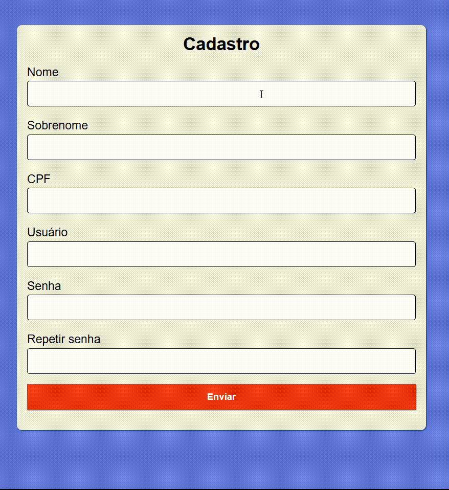

<h1>Formulário de Validações</h1>

Esse projeto desenvolvido em HTML, CSS e JavaScript é um formulário de validações. O formulário valida os dados inseridos pelo usuário e, caso não sejam válidos, o sistema exibe uma mensagem alertando o usuário.

<h2>Tecnologias utilizadas</h2>
<uL>
 <li>HTML5</li>
 <li>CSS3</li>
 <li>JavaScript</li>
 <li>Visual Studio Code v1.99.0</li>
</uL>

<h2>Estrutura das pastas</h2>
<pre>
FORM-VALIDATOR/
├── assets/
│   ├── img/                       # Imagens usadas no projeto
│   │   └── [imagem]
│   │
│   ├── css/                       # Arquivos de estilo do site
│   │   └── style.css
│   │
│   └── js/                        # Scripts do site
│       └── index.js
│
└── index.html                     # Página principal do projeto 
</pre>
Outros arquivos foram omitidos por não serem essenciais para o entendimento da estrutura do projeto.

<h2>Funcionalidades</h2>
<ul>
 <li><strong>Validações de entrada de dados</strong>:</li>
 <ul>
  <li><strong>Campos obrigatórios</strong>: o sistema exibe uma mensagem de aviso caso algum campo obrigatório esteja vazio.</li>
   
  <li><strong>Validação de CPF</strong>:</li>
  <ul>
   <li><strong>CPF inválido</strong>: o sistema informa o usuário quando o número de CPF digitado não é válido.</li>
   <li><strong>CPF sequêncial</strong>: é exibida uma mensagem de erro se o usuário informar um CPF com números repetidos de forma sequencial (ex: 111.111.111-11).</li>
   <li><strong>CPF incompleto</strong>: o sistema alerta o usuário quando o CPF digitado possui menos ou mais de 11 dígitos.</li>
  </ul>
   
  <li><strong>Nome de usuário incompleto</strong>: ao preencher o campo "Usuário" com menos de 3 caracteres, o sistema notifica o usuário sobre a necessidade de um nome mais completo.</li>
   
  <li><strong>Validação de senha</strong>:</li>
  <ul>
    <li><strong>Letras maiúsculas</strong>: o sistema exige ao menos uma letra maiúscula na senha.</li>
    <li><strong>Números</strong>: é necessário incluir pelo menos um número na senha.</li>
    <li><strong>Caracteres especias</strong>: a senha deve conter ao menos um caractere especial.</li>
    <li><strong>Senhas iguais</strong>: o sistema verifica se os campos "Senha" e "Repetir Senha" possuem valores idênticos.</li>
  </ul>
 </ul>
</ul>

<h2>Demonstração das funcionalidades</h2>

  

<h2>Como rodar este projeto</h2>

Não há nenhuma depedência ou pré-requisito necessário para rodar este projeto em seu ambiente, apenas siga o passo-a-passo a seguir:

<ol>
 <li>Navegue até o diretório pretendido:</li>
 <pre><code>cd caminho/do/diretorio</code></pre>
 <li>No diretório escolhido, clone o repositório:</li>
 <pre><code>git clone https://github.com/MatheusVenturaNellessen/form-validator.git</code></pre>
 <li>Abra o arquivo <strong>index.html</strong> em um navegador para visualizar o formulário.</li>
</ol>

<h2>Contribuições</h2>

Este projeto está aberto para contribuições através de issues. Caso você tenha encontrado um bug, queira sugerir uma melhoria ou tenha dúvidas sobre o funcionamento do projeto, por favor, siga as instruções abaixo:

<ol>
    <li>Verifique se já existe uma issue da situação aberta. Se já existir, adicione seu comentário na issue existente.
    <li>Caso não tenha sido aberta, crie uma issue nova.
</ol>

<h2>Licença e Autor</h2>

Este projeto foi desenvolvido por <a href="https://www.linkedin.com/in/matheus-ventura-nellessen/">Matheus Ventura Nellessen</a> e está licenciado sob a licença MIT. Veja o <a href="./LICENSE">documento</a> para mais detalhe.

